<!-- Cover Page -->

    

        Protect the Attacker
    

    

        Governance, Risk &amp; Compliance
    

    

        Auditing a Kali Linux system with Lynis and hardening it per CIS Benchmark recommendations
    

    

    

        <strong>Robin Reinhardt</strong>
    

    

        August 2026
    

<!-- First Page -->
# Kali Linux System Hardening – GRC Audit Report

**Auditor:** Robin Reinhardt
**System:** Kali GNU/Linux Rolling (2026.3), Kernel 7.0.12+kali, VMware VM
**Audit Tool:** Lynis 3.1.6
**Frameworks:** CIS Debian Linux 13 Benchmark v1.0.0 (primary), NIST 800-171
**Date:** August 2026

---

## 1. Executive Summary

This project audited and hardened a Kali Linux system following the full GRC cycle: identify → analyze → remediate → map controls → document. Lynis served as the audit tool, the CIS Debian 13 Benchmark as the remediation guide, mapped to NIST 800-171.

The initial audit produced a Hardening Index of **64**, with 1 warning and 56 suggestions. Ten findings were selected and worked through: six were remediated with configuration changes, one received a targeted partial fix with the remainder accepted as risk, one was documented as accepted risk, and two were assessed as already compliant. An additional CIS control (GPG key permissions) was verified compliant as a bonus.

After remediation and a reboot, the final scan returned a Hardening Index of **67** with the suggestion count reduced from 56 to **43** — thirteen fewer. The modest three-point index rise is discussed in the conclusion: the index heavily weights Kali's deliberately-retained offensive tooling and exposed services, which were intentionally left in place, so the score understates the security improvement actually achieved.

| Metric | Initial | Final | Delta |
| --- | --- | --- | --- |
| Hardening Index | **64** | **67** | **+3** |
| Warnings | 1 | 1 | 0 |
| Suggestions | 56 | 43 | **−13** |
| Tests performed | 278 | 281 | +3 |

    

        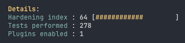
        <em>Initial Hardening Index</em>
    

    

        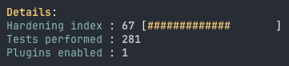
        <em>Final Hardening Index</em>
    

**Findings remediated:** default umask, password aging, login banners, GRUB bootloader password, auditd (daemon + config + rules), unused network protocols, package tooling, SSH password authentication.

**Assessed as compliant:** password hashing (yescrypt), grub.cfg permissions, GPG key permissions.

**Accepted risks:** single nameserver, remaining SSH hardening options.

<!-- Page Break -->

<!-- Second Page -->
## 2. Initial Findings

### 2.1 Initial Lynis Scan

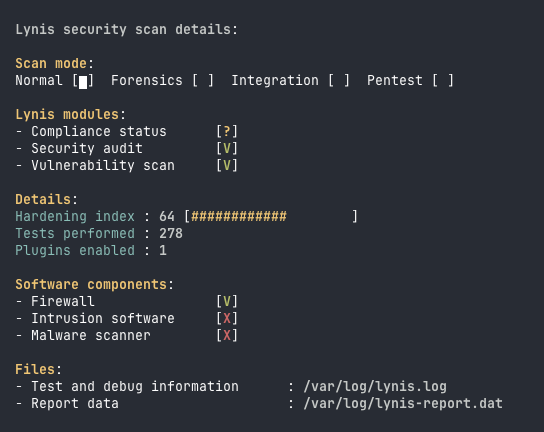

### 2.2 Mitigation Plan / Risk Register

| # | Finding (Lynis) | Description | CIS Control # | NIST 800-171 | Mitigation Plan | Status |
| --- | --- | --- | --- | --- | --- | --- |
| 1 | `AUTH-9328` | Missing default umask | 5.4.3.3 | 3.1.5 | umask 027 in login.defs + profile.d | **Done** |
| 2 | `AUTH-9286` | Password aging not configured | 5.4.1.1–5.4.1.3 | 3.5.6 | PASS_MAX/MIN/WARN + chage | **Done** |
| 3 | `AUTH-9230` | Password hashing algorithm | 5.4.1.4 | 3.13.11 | Assess – yescrypt already used | **Compliant** |
| 4 | `BANN-7126/7130` | Weak login banners | 1.6.2–1.6.6 | 3.1.9 | Warning text + permissions | **Done** |
| 5 | `BOOT-5122` | No GRUB password | 1.4.1 | 3.1.1, 3.4.5 | PBKDF2 password + --unrestricted | **Done** |
| 6 | `SSH-7408` | SSH not hardened | — (Lynis) | 3.1.12, 3.13.8 | Disable password auth; rest accepted | **Partial / Accepted** |
| 7 | `ACCT-9628` | auditd not active | 6.2.1–6.2.3 | 3.3.1, 3.3.2 | Install auditd + config + core rules | **Done** |
| 8 | `PKGS-7370` / `DEB-0810` | Package verification / tooling missing | — (Lynis/project) | 3.4.1 | debsums, apt-listbugs/-changes, apt-show-versions | **Done** |
| 9 | `NETW-3200` | Unused protocols (dccp/sctp/rds/tipc) | 3.2.3–3.2.6 | 3.4.6 | Blacklist kernel modules | **Done** |
| 10 | `NETW-2705` | Only 1 responsive nameserver | — (no CIS control) | — | Document as Accepted Risk | **Accepted Risk** |
| Bonus | CIS 1.2.1.3 | GPG key file permissions | 1.2.1.3 | 3.4.1 | Verify ownership/permissions | **Compliant** |

_Status values: Not Started → In Progress → Done → Compliant → Accepted Risk / Not Applicable_

---

## 3. Mitigation Process & Evidence

### 3.1 AUTH-9328 – Weak/Missing Default umask (CIS 5.4.3.3)

- **Risk:** No default umask was configured in `/etc/login.defs`, `/etc/profile.d/` or `/etc/bash.bashrc`, so new files defaulted to umask 022 (`-rw-r--r--`), granting all local users read access to newly created files. This violates least privilege. *(NIST 800-171: 3.1.5 Least Privilege)*
- **Mitigation:** Configured a default umask of `027` per CIS Debian 13 Benchmark Section 5.4.3.3, across all three locations the control specifies: ran the benchmark script to comment out weaker umask values in `/etc/profile.d/*.sh`, created `/etc/profile.d/60-default_umask.sh` with `umask 027`, and appended `UMASK 027` to `/etc/login.defs`.
- **Evidence:** Verified active value in a new shell via `umask -S` → `u=rwx,g=rx,o=`, confirming new directories become `drwxr-x---` and files `-rw-r-----`. Final Lynis scan confirms `umask (/etc/login.defs) [ OK ]`.

**Remediation script (from benchmark):**

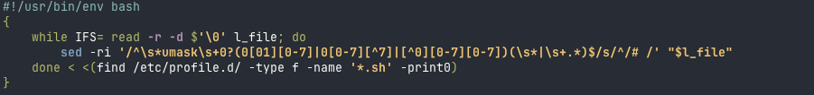

**Verification – config and active value:**

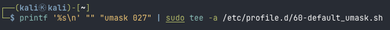

    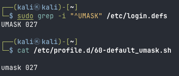
    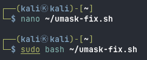

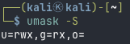

### 3.2 AUTH-9286 – Password Aging Not Configured (CIS 5.4.1.1 / 5.4.1.2 / 5.4.1.3)

- **Risk:** Password aging was effectively disabled: `PASS_MAX_DAYS` was 99999 (passwords never expire) and `PASS_MIN_DAYS` was 0 (no limit on change frequency). This weakens password hygiene and lets compromised credentials remain valid indefinitely. *(NIST 800-171: 3.5.6)*
- **Mitigation:** Set `PASS_MAX_DAYS 365`, `PASS_MIN_DAYS 1`, `PASS_WARN_AGE 7` in `/etc/login.defs` for future accounts per CIS Sections 5.4.1.1–5.4.1.3, and applied the same values to existing accounts with `chage` (via the benchmark's awk one-liners over `/etc/shadow`).
- **Evidence:** `grep ^PASS_ /etc/login.defs` confirms the new defaults; `chage -l kali` confirms the existing account now shows Maximum 365 / Minimum 1 / Warning 7, with password expiry moved from 2300 to Mar 24, 2027. Final Lynis scan confirms password aging minimum/maximum `[ CONFIGURED ]` and `Accounts without expire date [ OK ]`.

**Before:**

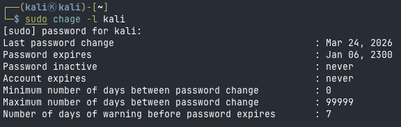

**After:**

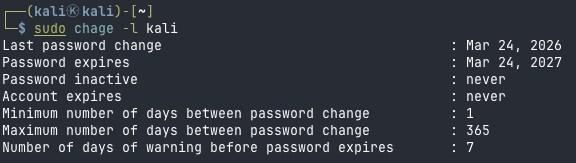

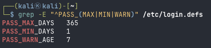

### 3.3 AUTH-9230 – Password Hashing Algorithm (CIS 5.4.1.4) — *Already Compliant*

- **Risk:** Weak password hashing (e.g. MD5/DES) would allow fast offline cracking of stolen `/etc/shadow` hashes. *(NIST 800-171: 3.13.11)*
- **Assessment:** System already uses **yescrypt**, a memory-hard algorithm explicitly accepted by CIS 5.4.1.4 (SHA512 *or* yescrypt). `ENCRYPT_METHOD YESCRYPT` is set in `/etc/login.defs` and PAM (`common-password`) uses the matching algorithm (`pam_unix.so obscure yescrypt`), satisfying the benchmark's consistency requirement. No change required.
- **Evidence:** `grep ENCRYPT_METHOD /etc/login.defs` → YESCRYPT; PAM line confirms yescrypt; stored hash prefix `$y$` in `/etc/shadow` confirms yescrypt in active use.
- **Note on residual Lynis suggestion:** The final Lynis scan still lists AUTH-9230 ("Configure password hashing rounds in /etc/login.defs"). This is a known tool/benchmark divergence: the `SHA_CRYPT_*_ROUNDS` directive only applies to SHA512-based hashing. yescrypt manages its cost factor internally and ignores that directive, so setting it would have no effect. The control's underlying intent — a strong, modern hashing algorithm — is fully met. Documented as compliant rather than actioned.

**CIS Recommendation:**

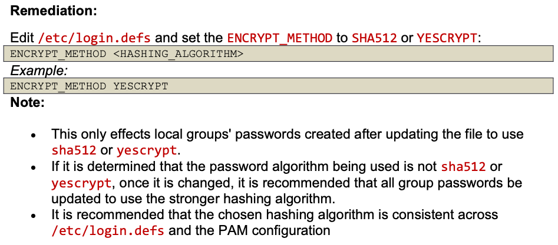

**Evidence – already compliant:**

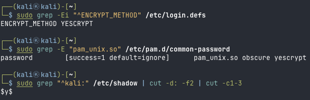

### 3.4 BANN-7126 / BANN-7130 – Legal Login Banners (CIS 1.6.2–1.6.6)

- **Risk:** `/etc/issue` and `/etc/issue.net` contained the default OS/version string with escape placeholders (`\n`, `\l`) instead of a legal warning. This disclosed OS information pre-authentication and provided no notice that access is restricted, weakening the legal basis for pursuing unauthorized access. *(NIST 800-171: 3.1.9 System Use Notification)*
- **Mitigation:** Replaced the contents of `/etc/issue` and `/etc/issue.net` with a neutral authorized-use warning per CIS 1.6.2/1.6.3, removing all OS references and placeholders. Set ownership `root:root` and mode `rw-r--r--` on `/etc/issue`, `/etc/issue.net` and `/etc/motd` per CIS 1.6.4–1.6.6.
- **Evidence:** `cat` before/after shows the OS string (`Kali GNU/Linux Rolling \n \l`) replaced by the warning banner; `ls -l` confirms `-rw-r--r-- root root` on all three files.
- **Note on residual Lynis suggestion:** BANN-7126/7130 still appear in the final scan. Lynis applies its own heuristic for what counts as a valid banner and does not clear these tests merely because a warning string is present; the CIS controls (1.6.2–1.6.6), which govern content and permissions, are satisfied. The divergence is a tool-specific check, not an unremediated control.

**Before:**

**After:**

### 3.5 BOOT-5122 – GRUB Bootloader Password (CIS 1.4.1)

- **Risk:** Without a bootloader password, anyone with console/physical access can edit GRUB entries at boot (e.g. append `init=/bin/bash`) to gain unauthenticated root access. *(NIST 800-171: 3.1.1, 3.4.5; NIST 800-53 AC-3)*
- **Mitigation:** Generated a PBKDF2 hash (`grub-mkpasswd-pbkdf2`, 600 000 iterations), set `superusers` + `password_pbkdf2` in `/etc/grub.d/40_custom` per CIS 1.4.1, and added `--unrestricted` to `/etc/grub.d/10_linux` so the system boots without a prompt while GRUB edit/console access requires authentication. Ran `update-grub` and rebooted.
- **Evidence:** `grep` on generated `/boot/grub/grub.cfg` confirms `set superusers`, `password_pbkdf2`, and `--unrestricted` on all menuentries; system rebooted normally (verified via SSH reconnect). Final Lynis scan confirms `Checking for password protection [ OK ]` (was `[ NONE ]`).
- **Note:** `/etc/grub.d/10_linux` may be overwritten by `grub-common` package updates (per CIS additional info); re-check after GRUB updates. `/boot/grub/grub.cfg` permissions already compliant (600, root:root) per CIS 1.4.2.

**Before (no bootloader password set):**

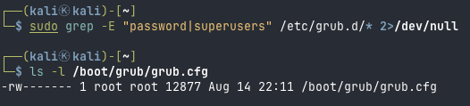

**Config – --unrestricted in 10_linux:**

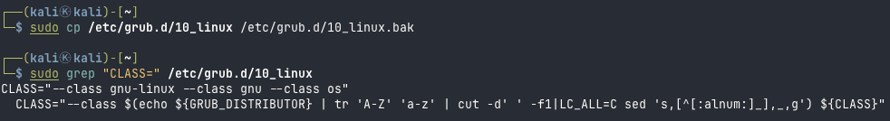

**After – generated grub.cfg contains superusers / password_pbkdf2 / --unrestricted:**

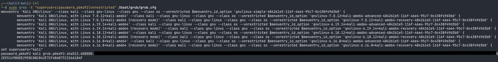
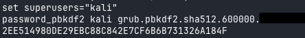
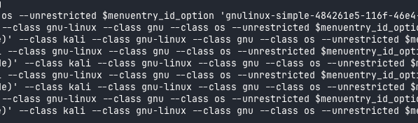

### 3.6 ACCT-9628 – Audit Daemon, Configuration & Rules (CIS 6.2.1 / 6.2.2 / 6.2.3)

- **Risk:** Without `auditd`, security-relevant events (authentication, privilege use, changes to identity and configuration files) are not recorded, leaving no forensic trail for detection or incident response. *(NIST 800-171: 3.3.1, 3.3.2 Audit & Accountability)*
- **Mitigation:**
  - **6.2.1** Installed `auditd` + `audispd-plugins`; unmasked, enabled and started the service.
  - **6.2.2** Set `max_log_file_action = keep_logs` (CIS 6.2.2.2) to prevent automatic deletion of audit logs. `max_log_file = 8` already compliant (6.2.2.1).
  - **6.2.3** Deployed a curated core rule set in `/etc/audit/rules.d/cis-core.rules` (13 rules) covering identity files (`passwd/shadow/group/gshadow`), sudoers scope, login records, audit-config self-protection, sudo/privilege use, and system identity — loaded via `augenrules`.
- **Accepted Risks (documented deviations):**
  - **6.2.2.3** `admin_space_left_action` kept at `SUSPEND` rather than CIS `single`/`halt`; halting the VM on a full audit log is disproportionate in a lab, and `keep_logs` + bounded `max_log_file` already control growth.
  - **6.2.2.4** `space_left_action = SYSLOG` retained instead of CIS `email`/`exec`/`single`/`halt`; `email` requires a configured MTA not present in the lab, and syslog fulfils the low-space-notification intent.
  - **6.2.3 (scope)** A curated core rule set was chosen over the full CIS rule catalogue; heavy syscall rules (e.g. `execve`, `chmod`/`chown` tracking) were omitted to avoid excessive log volume on an actively used offensive system.
- **Evidence:** `dpkg -l` + `systemctl is-active/is-enabled` (auditd active/enabled); `auditctl -s` (`enabled 1`, pid running); `auditctl -l` lists the 13 loaded rules; **live verification** — `touch /etc/hosts` followed by `ausearch -k system-locale` produced a SYSCALL record with `key="system-locale"`, `exe="/usr/bin/touch"`, `auid=1000`, confirming the rule actively logs and attributes the action to the originating user.

**Before (auditd not installed):**

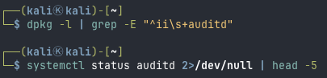

**After – installed, active, enabled:**

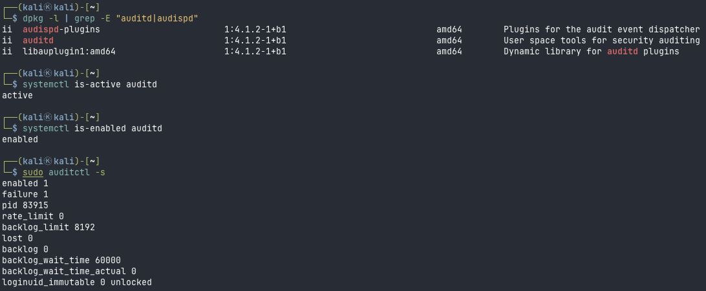

**Config (6.2.2) before / after:**

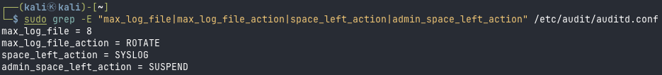

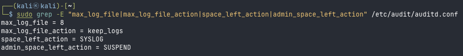

**Rules (6.2.3) – core rule set and loaded rules:**

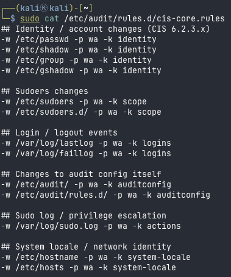

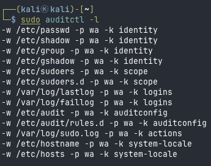

**Live verification – rule fires on file access:**

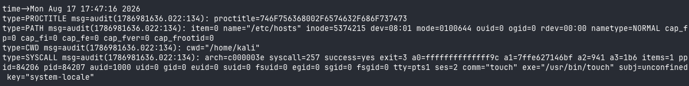

### 3.7 PKGS-7370 / PKGS-7394 / DEB-0810 / DEB-0811 – Package Verification & Patch Tooling

- **Risk:** Without package-integrity verification (debsums), version/patch visibility (apt-show-versions) and pre-upgrade bug/change notices (apt-listbugs/apt-listchanges), tampering or regressions may go unnoticed. *(NIST 800-171: 3.4.1 Baseline configuration, 3.14.1)*
- **Assessment / Mitigation:** These four tools are recommended by Lynis and required by the project brief, but have **no direct CIS Debian 13 control** — CIS addresses package trust via GPG key signing/permissions (1.2.1.x) rather than post-install checksum verification. Installed all four; ran `debsums -s` and `apt-show-versions` to confirm they function.
- **Evidence:** `dpkg -l` before (absent) / after (all four `ii`). `debsums -s` returned five deviations, all assessed as benign: NordVPN runtime data files (updated by the app), a doc changelog, and the intentionally-decompressed `rockyou.txt.gz` wordlist — no unexpected binary tampering. `apt-show-versions` shows all packages `uptodate`. Final Lynis scan confirms `apt-listbugs`/`apt-listchanges [ Installed ]` and `debsums utility [ FOUND ]`.
- **Note:** Lynis PKGS-7370 now suggests enabling a debsums cron job (`CRON_CHECK`) — a follow-up hardening step beyond installing the tool.

**Before / After (packages absent → installed):**

**Tools applied:**

### 3.8 CIS 1.2.1.3 – GPG Key File Permissions — *Already Compliant (bonus control)*

- **Risk:** World- or group-writable APT GPG keyrings could be replaced, letting an attacker sign malicious packages as trusted. *(NIST 800-171: 3.4.1)*
- **Assessment:** All APT keyring files in `/etc/apt/trusted.gpg.d/` and `/usr/share/keyrings/` are owned `root:root` with `rw-r--r--`. The `rwxrwxrwx` entries are symlinks (permissions not applicable; their targets are correctly restricted). No change required per CIS 1.2.1.3.
- **Evidence:** `ls -l` of both directories; `find ... ! -user root -o ! -group root -o -perm /022` returns empty, confirming no non-compliant regular files.

**Evidence:**
<!--
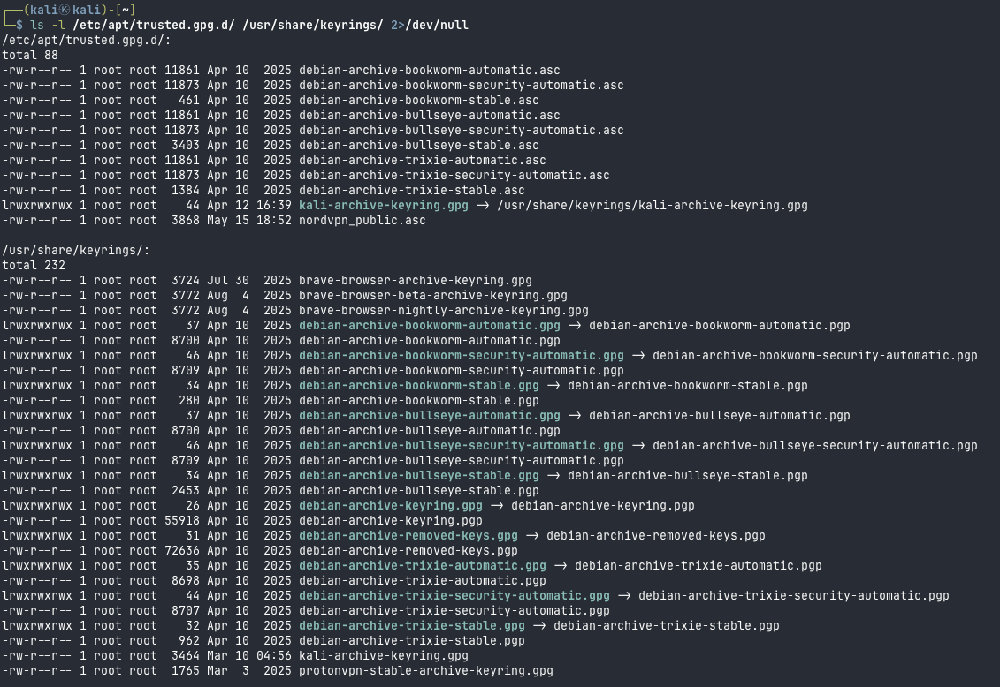
-->
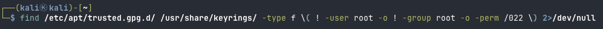

### 3.9 NETW-3200 – Unused Network Protocols (CIS 3.2.3–3.2.6)

- **Risk:** Uncommon protocols `dccp`, `sctp`, `rds` and `tipc` increase the kernel attack surface if loadable but unused; several have had past kernel CVEs. *(NIST 800-171: 3.4.6 Least Functionality)*
- **Mitigation:** For each module, unloaded it and created a `.conf` file in `/etc/modprobe.d/` with `install <mod> /bin/false` and `blacklist <mod>`, per CIS 3.2.3–3.2.6.
- **Evidence:** `/etc/modprobe.d/60-{dccp,rds,sctp,tipc}.conf` contain the two directives each. `dccp` is not present in this kernel (`modprobe: FATAL: Module dccp not found`); `rds`/`sctp`/`tipc` exist but a real load attempt is blocked — `sudo modprobe rds` returns `Error running install command '/bin/false' ... retcode 1` and `lsmod` remains empty. Final Lynis scan confirms `Uncommon network protocols [ NOT FOUND ]` (previously listed) and NETW-3200 no longer appears in the suggestions.
- **Lesson learned:** `modprobe -n -v <mod>` is not a reliable test for `install` overrides — it prints the theoretical load path, not the `install` hook. A real `modprobe <mod>` checking the exit code plus `lsmod` is the authoritative verification.

**Before (not loaded, no blacklist):**

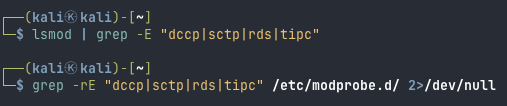

**After – config files and blocked load attempts:**

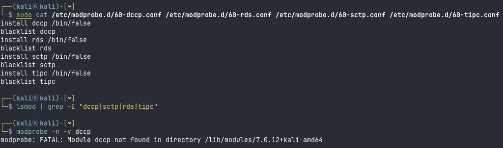

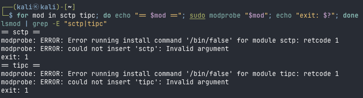

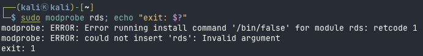

### 3.10 SSH-7408 – SSH Hardening (Partial Fix + Accepted Risk)

- **Risk:** Default `sshd` settings leave a wider attack surface than necessary. Most critically, `PasswordAuthentication` defaulted to `yes`, leaving the SSH service open to password brute-force attacks even though key-based login is in use. *(NIST 800-171: 3.1.12, 3.13.8)*
- **Fixed:** Set `PasswordAuthentication no` via a drop-in in `/etc/ssh/sshd_config.d/`, closing the password brute-force vector while key-based auth remains active. Verified with `sshd -T` → `passwordauthentication no`, `pubkeyauthentication yes`; connectivity re-tested with a second SSH session before closing the first.
- **Accepted Risk:** The remaining Lynis suggestions (custom `Port`, `MaxAuthTries`, `MaxSessions`, `X11Forwarding`, `AllowTcpForwarding`, `ClientAliveCountMax`, `LogLevel VERBOSE`, `TCPKeepAlive`, `AllowAgentForwarding`) were assessed as disproportionate for an isolated lab VM where key-only authentication already closes the primary vector. They remain in the final scan by design and are accepted rather than remediated.

**Before (`sshd -T` — password auth enabled):**

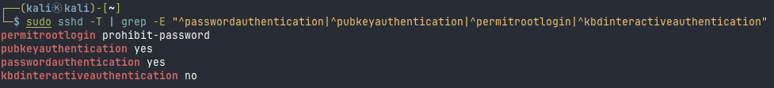

**After (`sshd -T` — password auth disabled):**

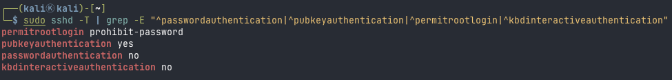

### 3.11 NETW-2705 – Responsive Nameservers (Accepted Risk)

- **Risk:** Only one responsive nameserver reduces DNS resolution resilience; a resolver outage would break name resolution.
- **Assessment:** This is the audit's single remaining warning. There is **no direct CIS control**; the recommendation stems from Lynis tool documentation. On an isolated lab VM with a single upstream resolver (`192.168.70.1`), a second nameserver adds no meaningful resilience. Risk accepted and documented; no change made.

## 4. Final Results & Conclusion

### 4.1 Final Lynis Scan

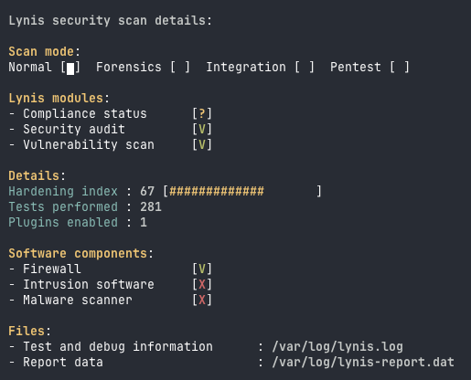

### 4.2 Comparison

| | Initial | Final | Delta |
| --- | --- | --- | --- |
| Hardening Index | 64 | 67 | **+3** |
| Warnings | 1 | 1 | 0 |
| Suggestions | 56 | 43 | **−13** |
| Tests performed | 278 | 281 | +3 |

### 4.3 Confirmation of Resolved Findings

The following improvements are directly confirmed in the final Lynis output:

- `umask (/etc/login.defs)` → **OK** (was a suggestion)
- Password aging minimum / maximum → **CONFIGURED**; `Accounts without expire date` → **OK**
- GRUB `Checking for password protection` → **OK** (was NONE)
- `Uncommon network protocols` → **NOT FOUND** (NETW-3200 cleared from suggestions)
- `apt-listbugs` / `apt-listchanges` → **Installed**; `debsums utility` → **FOUND**

Two remediated findings (BANN-7126/7130, AUTH-9230) still appear in the final scan due to tool/benchmark divergence, explained in their respective sections: the CIS controls are satisfied, but Lynis applies its own heuristics (banner content check; SHA512-oriented hashing-rounds directive that does not apply to yescrypt).

### 4.4 Accepted Risks / Not Applicable

| Finding | Justification |
| --- | --- |
| `NETW-2705` | Lab VM; a single nameserver is sufficient. No direct CIS control; based on Lynis tool documentation only. |
| `SSH-7408` (partial) | Key-based authentication is active and password auth disabled, closing the primary vector. Remaining options (port change, forwarding restrictions, session limits) assessed as disproportionate in an isolated lab. |
| `auditd` 6.2.2.3 / 6.2.2.4 | Availability prioritised over strict audit-continuity in a lab; `email` action requires an MTA not present. |
| `auditd` 6.2.3 scope | Curated core rule set instead of the full CIS catalogue to avoid excessive log volume on an actively-used offensive system. |
| Kali offensive services & tooling (Apache, Docker, xrdp, compilers, exposed systemd units) | Retained by design — they constitute the working environment of an offensive distribution and are out of scope for this hardening exercise. |

### 4.5 Key Learnings & Challenges

**On the modest index rise (64 → 67).** The three-point increase understates the work done. Thirteen suggestions were closed and every targeted control verified, but the Hardening Index also weights a large set of intentionally-retained items — `UNSAFE`-rated systemd services (docker, cups, xrdp, nordvpn, ssh), missing filesystem partitioning, present compilers, and Apache/PHP exposure — that are inherent to Kali as an offensive platform. Hardening those would degrade the system's purpose. The index therefore measures a surface from which only the sensibly-hardenable elements were removed; the large structural items remain by design. The **−13 suggestions** figure is the more honest measure of progress.

**Translating tool IDs to framework controls.** Lynis test IDs (AUTH-9328, BOOT-5122, NETW-3200) are Lynis-specific and do not appear in the CIS Benchmark. Each finding required a topic-based lookup (umask, bootloader password, kernel module) to locate the corresponding CIS section — a core GRC skill: mapping a tool's output onto a recognised control framework.

**Knowing when *not* to act.** Several findings were correctly resolved without changes: yescrypt already satisfies CIS 5.4.1.4 (the Lynis "hashing rounds" hint targets SHA512); the GPG-keyring `777` entries were symlinks, not a vulnerability. Recognising a non-issue and documenting it is as valuable as applying a fix.

**Proportional risk decisions on an offensive distro.** Rather than blindly applying every control, deviations were made deliberately and documented: SSH hardening reduced to the one change that matters under key-only auth; auditd's halt-on-full avoided; the full auditd rule catalogue curated down. This proportionality — matching the control to the actual risk and environment — is the essence of GRC.

**Verification technique matters.** The `modprobe -n -v` dry-run misleadingly suggested the protocol blacklist had failed; a real load attempt proved it worked. Trusting the right verification method, not the convenient one, is what separates a genuine control assessment from a checkbox.